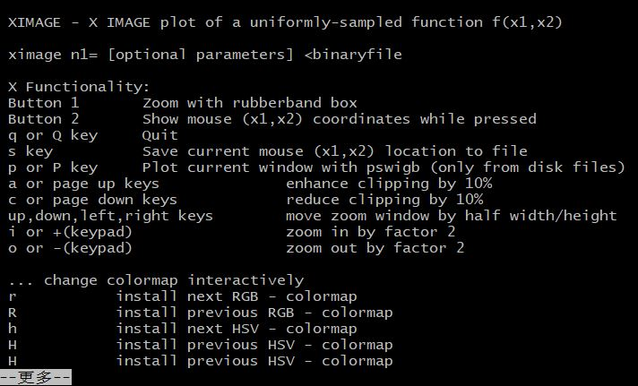

# CWP-SeismicUnix-src
Get source code from seismicunix that can be compiled separately

## CWP_ximage
* ximage
* compiled and use
```shell
$ make
$./ximage #for help
$./ximage < input.dat n1=201 perc=99 &
```
*


